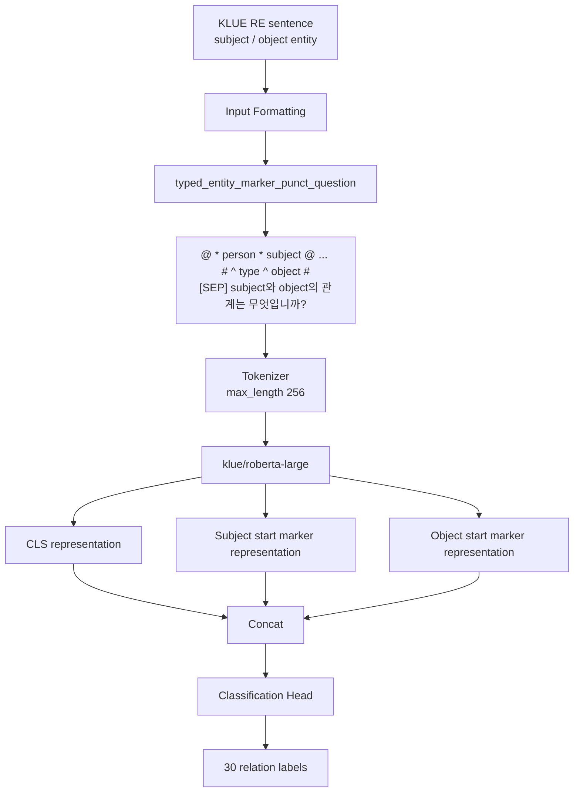

# KLUE Relation Extraction 실험 프로젝트

Hugging Face `load_dataset("klue", "re")` 기반으로 KLUE-RE 데이터셋의 subject/object entity 사이 관계를 분류하는 프로젝트입니다.

본 프로젝트의 목적은 단일 모델 학습이 아니라, Relation Extraction 성능에 영향을 주는 요소를 단계적으로 비교하고 최종 모델 구조를 결정하는 것입니다.

## 핵심 요약

- Task: 문장 내 subject entity와 object entity 사이의 관계 분류
- Dataset: Hugging Face `load_dataset("klue", "re")`
- Train/Val/Test 구성:
  - Hugging Face 원본 `train` split을 다시 train/val로 분할
  - Hugging Face 원본 `validation` split을 최종 test로 사용
- 최종 기준 모델:
  - `klue/roberta-large`
  - `detailed_stratified` split
  - `typed_entity_marker_punct_question` input format
  - `entity_start` architecture
- 주요 평가지표:
  - KLUE-RE 공식 micro-F1: `no_relation` 제외
  - KLUE-RE AUPRC: 전체 30개 class 포함
  - 모든 지표는 0~100 scale로 저장

## 프로젝트 구조

```text
.
├─ configs/
│  ├─ split_*.yaml
│  ├─ preprocess_*.yaml
│  ├─ architecture_*.yaml
│  ├─ model_*.yaml
│  └─ improvement_weighted_ce_roberta_large.yaml
├─ data/
│  └─ raw/klue_re/
├─ notebooks/
│  ├─ eda.ipynb
│  └─ full_pipeline.ipynb
├─ outputs/
│  ├─ split_experiments.csv
│  ├─ preprocess_experiments.csv
│  ├─ architecture_experiments.csv
│  ├─ model_experiments.csv
│  ├─ improvement_experiments.csv
│  ├─ experiments.csv
│  └─ improvement_details/
├─ src/
│  ├─ data_loader.py
│  ├─ dataset_split.py
│  ├─ preprocess.py
│  ├─ train.py
│  ├─ evaluate.py
│  ├─ error_analysis.py
│  ├─ split_experiments.py
│  ├─ preprocess_experiments.py
│  ├─ architecture_experiments.py
│  ├─ model_experiments.py
│  ├─ improvement_experiments.py
│  ├─ models.py
│  ├─ tokenization.py
│  ├─ custom_trainer.py
│  ├─ losses.py
│  └─ utils.py
└─ README.md
```

## 최종 모델 구조



최종 조건:

```yaml
model_name_or_path: klue/roberta-large
split_strategy: detailed_stratified
input_style: typed_entity_marker_punct_question
architecture: entity_start
max_length: 256
learning_rate: 3e-5
num_train_epochs: 5
per_device_train_batch_size: 8
gradient_accumulation_steps: 8
per_device_eval_batch_size: 16
warmup_ratio: 0.1
weight_decay: 0.01
metric_for_best_model: micro_f1
```

## 실험 흐름

### 1. EDA

노트북: `notebooks/eda.ipynb`

확인한 내용:

- 데이터 기본 정보
- 결측치
- 완전 중복 데이터
- label 분포
- subject type / object type 조합과 label 간 빈도
- test 데이터 label 분포

주요 해석:

- `no_relation` 비중이 크므로 class imbalance를 고려해야 함
- subject/object type 조합이 label과 연관되어 있어 typed marker 실험 필요
- `{label}-{subject_type}-{object_type}` 기준의 detailed stratified split 실험 필요

### 2. Data Split 실험

실행 파일: `src/split_experiments.py`

비교 방식:

- `random`
- `label_stratified`
- `detailed_stratified`

결과 파일:

- `outputs/split_experiments.csv`

최종 선택:

- `detailed_stratified`
- label뿐 아니라 subject/object type 조합까지 고려해 train/val 분포 안정성을 높이기 위함

### 3. Input Format 실험

실행 파일: `src/preprocess_experiments.py`

비교 방식:

- Prompt 계열
  - `s_sep_o`
  - `s_and_o`
  - `question`
  - `type_prompt`
- Marker 계열
  - `entity_marker`
  - `entity_marker_punct`
  - `typed_entity_marker`
  - `typed_entity_marker_punct`
- Entity marker + prompt 결합
  - `entity_marker_punct_s_and_o`
  - `entity_marker_punct_question`
  - `typed_entity_marker_punct_s_and_o`
  - `typed_entity_marker_punct_question`

결과 파일:

- `outputs/preprocess_experiments.csv`

최종 선택:

- `typed_entity_marker_punct_question`
- entity type 정보와 관계 질문 형태를 함께 제공하는 방식

### 4. Architecture 실험

실행 파일: `src/architecture_experiments.py`

비교 방식:

- `cls`: `[CLS]` representation만 사용
- `entity_start`: subject/object start marker representation 추가
- `entity_start_end`: subject/object start/end marker representation 추가

결과 파일:

- `outputs/architecture_experiments.csv`

최종 선택:

- `entity_start`
- subject/object의 위치 정보를 명시적으로 반영하면서 구조가 과도하게 복잡하지 않음

### 5. LLM 모델 선정 실험

실행 파일: `src/model_experiments.py`

비교 모델:

- `klue/roberta-base`
- `klue/roberta-large`
- `klue/bert-base`
- `studio-ousia/luke-large`

결과 파일:

- `outputs/model_experiments.csv`

최종 선택:

- `klue/roberta-large`
- 최종 고정 조건에서 가장 안정적인 성능을 보임

### 6. 성능 검토

실행 파일:

- `src/error_analysis.py`
- `src/performance_review.py`

분석 항목:

- relation별 precision/recall/F1
- entity type pair별 성능
- confusion matrix
- 오답 사례 분석

주요 산출물:

```text
outputs/architecture_entity_start/error_analysis_test/
├─ test_predictions.csv
├─ wrong_predictions.csv
├─ label_scores.csv
├─ type_pair_scores.csv
├─ label_type_pair_scores.csv
├─ confusion_matrix.csv
└─ confusion_matrix.png
```

### 7. 성능 개선 실험

실행 파일: `src/improvement_experiments.py`

비교 방식:

- `Weighted Cross Entropy`
  - train label frequency 기반 class weight 적용
- `Threshold tuning`
  - 탐색 범위: `0.50 ~ 0.90`
  - 간격: `0.05`
  - `val_micro_f1` 기준 best threshold 선택
- `Temperature calibration`
  - 탐색 범위: `1.0 ~ 3.0`
  - 간격: `0.2`
  - validation NLL 기준 best temperature 선택

결과 파일:

- `outputs/improvement_experiments.csv`
- `outputs/improvement_details/threshold_grid.csv`
- `outputs/improvement_details/calibration_grid.csv`

현재 저장된 개선 실험 요약:

| experiment | test_micro_f1 | test_auprc | note |
|---|---:|---:|---|
| baseline roberta-large + entity_start | 73.0369 | 77.2645 | architecture baseline |
| threshold tuning | 72.7582 | 77.2504 | best threshold 0.75 |
| temperature calibration | 73.0254 | 77.6612 | best temperature 1.6 |
| weighted cross entropy | 67.9449 | 76.9728 | class weighting 적용 |

해석:

- Temperature calibration은 AUPRC 개선에 도움이 됨
- Threshold tuning은 일부 `no_relation` 편향 완화 목적이지만 최종 micro-F1 개선은 제한적
- Weighted CE는 현재 조건에서는 성능 하락이 관찰되어 최종 모델에는 적용하지 않음


## 주요 결과 CSV 설명

| 파일 | 내용 |
|---|---|
| `outputs/experiments.csv` | 전체 단일 학습 결과 누적 |
| `outputs/split_experiments.csv` | split 전략 비교 |
| `outputs/preprocess_experiments.csv` | input format 비교 |
| `outputs/architecture_experiments.csv` | relation representation 구조 비교 |
| `outputs/model_experiments.csv` | LLM 모델 비교 |
| `outputs/improvement_experiments.csv` | weighted CE, threshold, calibration 결과 |
| `outputs/improvement_details/threshold_grid.csv` | threshold 후보별 세부 성능 |
| `outputs/improvement_details/calibration_grid.csv` | temperature 후보별 세부 성능 |

## 평가 지표

KLUE-RE 공식 기준 참고

- `micro_f1`
  - `no_relation` 제외
  - 0~100 scale
- `auprc`
  - `no_relation` 포함 전체 30 class
  - 0~100 scale
- `accuracy`, `macro_f1`
  - 분석용 보조 지표

## 참고 사항

- 최종 보고 흐름은 `notebooks/full_pipeline.ipynb`에서 확인할 수 있습니다.
